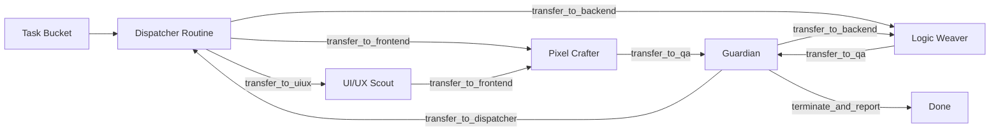

# AgentHive → Agent Swarm: Implementation Plan

## Architecture Overview



## Files to Create / Modify

### Python Engine (`apps/engine/app/`)

| File | Action | Purpose |
|------|--------|---------|
| `swarm/core.py` | **NEW** | `Transfer`, `SwarmRoutine`, `SwarmContext`, `Swarm` class + `run_swarm` loop |
| `swarm/routines.py` | **NEW** | 5 Routines: Dispatcher, UI/UX Scout, Logic Weaver, Pixel Crafter, Guardian |
| `swarm/handoffs.py` | **NEW** | All `transfer_to_*` functions + `terminate_and_report` |
| `swarm/__init__.py` | **NEW** | Public re-exports |
| `dispatcher.py` | **MODIFY** | Wire `run_factory` to use `run_swarm` instead of direct worker dispatch |
| `events.py` | **MODIFY** | Add `HANDOFF` and `SWARM_DONE` event types |

### TypeScript Dashboard (`apps/dashboard/`)

| File | Action | Purpose |
|------|--------|---------|
| `components/agent-graph.tsx` | **MODIFY** | Add `HandoffPulse` animated particle traveling along active edges |
| `components/collaboration-feed.tsx` | **MODIFY** | Add `HANDOFF` event rendering with horizontal flow chip |
| `lib/engine-client.ts` | **MODIFY** | Add `HANDOFF` and `SWARM_DONE` to `HiveEvent` type union |

---

## Phase 1: Swarm Engine Core (Python)

### `swarm/core.py`

```
SwarmContext:
  - task_id: str
  - task_title: str
  - task_description: str
  - history: list[Message]          # full conversation chain
  - context_variables: dict         # shared key-value state
  - artifact_bus: dict              # topic → payload (from MessageBus)
  - current_agent_role: str
  - handoff_chain: list[str]        # trail of roles for audit
  - session_dir: Path
  - hive_id: str
  - budget_remaining: float

Transfer:
  - target_routine: str             # the role to hand off TO
  - context: SwarmContext           # full context passed along
  - reason: str                     # why the handoff happened (for logs)

SwarmRoutine (abstract):
  - role: str
  - system_prompt: str
  - available_transfers: list[str]  # which roles this routine CAN transfer to
  - async run(ctx: SwarmContext) -> Transfer | str
    Returns Transfer to continue or str (final answer = terminate)

Swarm:
  - routines: dict[str, SwarmRoutine]
  - async run_swarm(entry: str, ctx: SwarmContext) -> str
    Loops: current = entry; while Transfer: current = transfer.target_routine
    Enforces: max 12 hops to prevent infinite loops
    Emits HANDOFF events on each transfer
```

### `swarm/handoffs.py`

```python
def transfer_to_uiux(ctx, reason) -> Transfer
def transfer_to_frontend(ctx, reason) -> Transfer
def transfer_to_backend(ctx, reason) -> Transfer
def transfer_to_qa(ctx, reason) -> Transfer
def transfer_to_dispatcher(ctx, reason) -> Transfer
def terminate_and_report(ctx, final_output) -> str
```

### `swarm/routines.py`

Each Routine's `run()` method:
1. Builds LLM prompt (system_prompt + context_block)
2. Calls `agent.think(prompt)` 
3. Parses response for:
   - `transfer_to_*` action block → returns Transfer
   - `terminate_and_report` action block → returns str
   - `write_file`, `execute_command` → execute, accumulate in context
4. Emits CHAT events for handoff decisions

**Routine Definitions:**

| Routine | Role | Can Hand Off To |
|---------|------|----------------|
| DispatcherRoutine | `swarm_dispatcher` | uiux_scout, logic_weaver, pixel_crafter, guardian |
| UiUxScout | `uiux_scout` | pixel_crafter, tech_architect |
| LogicWeaver | `logic_weaver` | guardian, devops_engineer |
| PixelCrafter | `pixel_crafter` | uiux_scout, guardian |
| Guardian | `guardian` | Previous developer (dynamic), swarm_dispatcher |

---

## Phase 2: Dispatcher Integration

Modify `dispatcher.py`:
- `_run_dispatcher_for_task()` → calls `run_swarm()` instead of `run_worker()`
- `SwarmContext` is built from `BucketTask` and passed to `Swarm.run_swarm()`
- On `terminate_and_report`: marks task COMPLETED in bucket, moves Kanban card
- `run_factory` keeps same loop but now each task runs through the Swarm

---

## Phase 3: New Event Types

Add to `events.py`:
- `"HANDOFF"` — emitted when a Transfer is executed. Payload: `{from_role, to_role, reason, hop_count}`
- `"SWARM_DONE"` — emitted when `terminate_and_report` is called. Payload: `{final_output, hops, task_id}`

---

## Phase 4: Dashboard — Pulse Animation

Modify `agent-graph.tsx`:
- `HandoffPulse` component: an animated `motion.circle` (or `motion.div`) 
  that travels from source node center to target node center along the edge path
- Triggered when a `HANDOFF` event arrives, using `{from_role, to_role}` to find edge
- CSS keyframe: opacity 0→1→0, scale 0.5→1.2→0.5, traveling along SVG path
- Duration: 1.2s per hop

Modify `collaboration-feed.tsx`:
- Add case for `event_type === "HANDOFF"` → renders a special "Hand-off Event" chip:
  `[UX_Agent] completed research → handing off to [Frontend_Agent]`
- Styled distinctly (violet/teal gradient chip with arrow icon)

---

## Phase 5: ROLE_CONFIG Updates (Dashboard)

Add new Swarm roles to `ROLE_CONFIG` in `agent-graph.tsx`:
- `swarm_dispatcher`: Brain + indigo
- `uiux_scout`: Palette + purple  
- `logic_weaver`: Server + emerald
- `pixel_crafter`: Globe + amber
- `guardian`: ShieldCheck + pink

---

## Implementation Order

1. `apps/engine/app/swarm/__init__.py`
2. `apps/engine/app/swarm/core.py`
3. `apps/engine/app/swarm/handoffs.py`
4. `apps/engine/app/swarm/routines.py`
5. `apps/engine/app/events.py` (add HANDOFF, SWARM_DONE)
6. `apps/engine/app/agents/prompts.py` (add Swarm routine prompts)
7. `apps/engine/app/dispatcher.py` (wire up run_swarm)
8. `apps/dashboard/components/agent-graph.tsx` (HandoffPulse)
9. `apps/dashboard/components/collaboration-feed.tsx` (HANDOFF chip)

> [!NOTE]
> The Swarm Engine is **additive** — the original `execute_hive` / Manager-Worker pattern
> is kept intact. The Swarm is a new execution path triggered by the Factory dispatcher.
